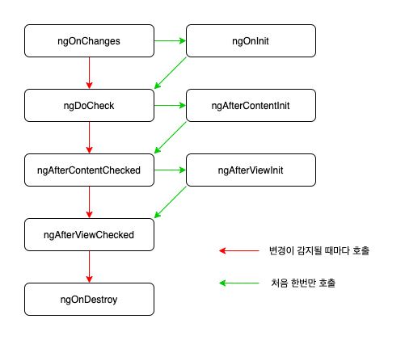

# Angular Component Lifecycle

안녕하세요. 오늘은 앵귤러의 기본이 되는 생명주기에 대해 알아보겠습니다.
앵귤러에는 8단계의 라이프 사이클이 있습니다. (constructor 함수는 타입스크립트에서 동작하므로 제외) 각 단계는 **라이프 사이클 훅 이벤트**라고 부릅니다.

---
## constructor
`constructor` 함수는 앵귤러와는 별개로 **타입스크립트**에서 호출하는 메서드입니다.  
`constructor` 함수에는 컴포넌트에 의존성들(예: 서비스)을 주입(inject)하는 것이 가장 좋습니다. `constructor` 함수가 실행된 후에 앵귤러의 라이프 사이클이 실행됩니다.

## ngOnChanges
`constructor` 함수 이후에 제일 처음 호출되는 라이프 사이클 훅 이벤트입니다.  
자식컴포넌트에서 `@Input` 데코레이터를 이용하면 부모 컴포넌트에서 프로퍼티를 전달 받을 수 있습니다. 부모 컴포넌트에서 전달해주는 프로퍼티가 변경되면 `ngOnChanges`가 **재 호출** 됩니다.  
부모 컴포넌트에서 **동일한 값을 전달 받거나 전달 받은 값이 객체 내의 프로퍼티만 바꾼 값**일 경우 호출되지 않습니다.  
`ngOnChanges` 훅 함수는 부모 컴포넌트에서 받은 프로퍼티의 정보를 담고 있는 `SimpleChanges` 파라미터를 하나 더 받습니다. 이 파라미터는 다음과 같은 프로퍼티를 갖고있습니다.

- previousValue : 이전에 받은 프로퍼티의 값을 갖고 있습니다.
- currentValue : 방금 받은 프로퍼티의 값을 갖고 있습니다.
- isFirstChange : 방금 받은 프로퍼티가 첫번째 프로퍼티라면 true, 아니라면 false를 반환합니다.

## ngOnInit
`ngOnChange` 훅 함수 이후에 호출되고 초기에 **한번만 호출**됩니다.  
클래스가 가지고있는 프로퍼티와 `@Input`을 통해 내려받은 프로퍼티가 모두 초기화가 된 이후에 호출됩니다.  
주로 프로퍼티 값 설정, 서비스를 이용해 HTTP통신후 결과값을 프로퍼티에 할당하는 등 화면에 데이터가 표시되기 전 필요한 프로퍼티들을 초기화 시키는데 사용됩니다.

## ngDoCheck

컴포넌트의 상태 변경을 감지한 후에 **항상 호출**됩니다. 그만큼 자주 실행되기 때문에 조심히 사용해야 합니다.  
주로 변경 감지 로직 구현, 다른 컴포넌트에 대한 알고리즘을 작성할때 사용합니다.

## ngAfterContentInit
컴포넌트의 템플릿을 컴포넌트 뷰로 준비하거나 뷰 안에 있는 디렉티브를 준비한 이후에 실행됩니다.  
이 방법은 구성요소의 모든 바인딩을 처음으로 점검할 필요가 있을 때 실행한다.  
`ngDoCheck` 훅 함수가 처음 실행된 직후에 **한 번만 호출**됩니다. 이 함수는 기본적으로 자식 컴포넌트 초기화와 연결 되어있습니다.

## ngAfterContentChecked
`ngAfterContentInit` 훅 함수가 실행된 후에 호출됩니다.  
앵귤러의 변경 감지 메커니즘에 의해 컴포넌트의 내용(content)의 변경을 확인(check)합니다. 또한 `ngDoCheck` 함수가 **실행될 때마다 이어서 호출**됩니다.  
이 함수 또한 기본적으로 자식 컴포넌트 초기화와 연결되어 있습니다.

## ngAfterViewInit
`ngAfterContextChecked` 훅 함수가 실행된 후에 호출됩니다.  
컴포넌트 뷰가 완전히 초기화 되었을때(자식 컴포넌트 포함) 실행됩니다. 이 라이프 사이클 훅 함수는 오직 컴포넌트에만 적용됩니다.  
자식 컴포넌트까지 완전히 초기화 되었을 때 실행되는 특성으로 인해, 부모 컴포넌트에서 자식 컴포넌트에 접근을 하는(@ViewChild 디렉티브) 함수를 사용할때 이 라이프 사이클 함수에 작성을 해줍니다.  
화면에 적용 하는 라이브러리(echart, D3 등)또는 @ViewChild 디렉티브를 사용하려면 이 훅 함수에 코드를 넣어야 하기 때문에 자주 사용하는 편입니다.

## ngAfterViewChecked
`ngAfterViewInit` 훅 함수가 실행된 후에 호출됩니다.  
앵귤러의 변경 감지 메커니즘에 컴포넌트 뷰(자식 컴포넌트 포함)를 확인(check)합니다. `ngAfterContentChecked` 훅 함수가 **실행될 때마다 이어서 호출**됩니다.

## ngOnDestroy
컴포넌트가 종료되기 직전에 옵저버블 구독해제, 이벤트 핸들러를 제거해서 메모리 누수를 방지힙니다. 

라이프 사이클에서 초기에 한번만 호출하는 훅 함수와 변경을 감지할 때마다 호출 함수를 나눈다면, 다음과 같은 그림이 됩니다.

## 마무리
앵귤러 프로젝트를 하면서 ngOnInit과 ngOnChanges, ngAfterViewInit, 그리고 ngOnDestory만 주로 사용 했었는데, 나머지 라이프 사이클도 유연하게 사용할 수 있도록 실력을 키워나가야겠습니다. 

글에 오류가 있으면 알려주세요. 감사합니다.

---

## REFERENCE

Max Koretskyi: [if-you-think-ngdocheck-means-your-component-is-being-checked-read-this-article](https://indepth.dev/if-you-think-ngdocheck-means-your-component-is-being-checked-read-this-article/)  
freecodecamp: [Angular Lifecycle Hooks: ngOnChanges, ngOnInit, and more](https://www.freecodecamp.org/news/angular-lifecycle-hooks/)
