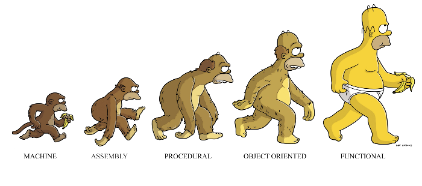

이 글은 Charles Scalfani의 [So You Want to be a Functional Programmer (Part 1)](https://medium.com/@cscalfani/so-you-want-to-be-a-functional-programmer-part-1-1f15e387e536) 를 번역한 게시물입니다.

Thank you Charles Scalfani! Thanks to your writing, I can grow further as a developer.

---




함수형 프로그래밍의 개념을 이해하기 위해 내딛는 첫걸음은 매우 중요하다. 매우 힘든 첫걸음이지만 올바른 관점으로 접근한다면 그리 힘들지 않다.

## 운전 배우기  


다른 사람들이 운전하는 것은 쉬워 보였지만, 막상 우리가 운전을 배울때가 되니 생각했던 것보다 더 어려웠었다.  
우리는 부모님의 차로 연습을 했고, 동네의 길을 완전히 익힐 때까지는 고속도로를 달리지 않았다.  
반복되는 연습과 공포스러운 순간들을 보내면서, 운전을 배우게 되고 마침내 운전면허증을 취득했다.

운전면허를 취득한 후, 여행할 때마다 우리의 운전실력은 점점 좋아졌고 자신감도 높아졌다.  
그러다 다른 사람의 차를 운전해야 하거나, 첫 차를 보내고 새 차를 사야하는 순간이 왔다.

**다른 사람의 차**에 **정말 처음으로 앉아 본 것인가?** 사실 처음은 아니었다.  
하지만 이전에 다른 사람의 차에 탔을 때는 조수석에 앉았었다. 이번에는 모든 것을 제어하는 운전석에 앉아있다.

운전을 시작하기전, 우리는 자신에게 몇 가지 질문을 던진다. 열쇠는 어디에 꽂고, 라이트는 어디에 있고, 어떻게 방향 지시등을 사용하고, 어떻게 사이드 미러를 조정해야하나?
그 후, 차를 꽤 순조롭게 운행한다. 처음 운전했을 때와 비교해서 왜 이렇게 쉬워진 것일까?

그 이유는 그 차가 예전 차와 꽤 비슷하기 때문이다. 다른 차에도 차에 필요한 기본적인 모든 것들을 갖고 있고, 비슷한 자리에 위치해 있다.

이전 차와 몇 가지가 다르게 구현된 부분도 있을테고, 추가된 기능들이 있을 수도 있다. 그 기능들은 당장은 필요하지 않다. 시간이 흘러 유용하다고 판단될 때가 되면 우리는 그 새로운 기능들을 자연스럽게 배우게 된다.

프로그래밍 언어를 배우는 것은 이와 같다. 프로그래밍 언어를 처음 배우기는 정말 어렵다. 그러나 일단 허리띠를 졸라매며 프로그래밍 언어 하나를 깨닫게 되면, 그 뒤에 배우는 것은 더 쉬워진다.

그 후 두번째 프로그래밍 언어를 배울때는, 다음과 같은 질문들을 할 것이다. "모듈을 어떻게 만들지? 배열을 어떻게 탐색하지? substring 함수에서 파라미터는 뭐지?"

당신은 새 언어를 쉽게 배울 수 있을 것이라고 확신한다. 그 새로운 언어는 당신이 예전에 배웠던 언어에서 편하게 사용하기 위해 몇 가지 새로운 것들이 추가된 것뿐이기 때문이다.

##당신의 첫 우주선


평생 한 대의 차를 운전해 왔든 수십 대의 차를 운전해 왔든, 당신이 우주선의 운전대 잡게 될 것이라고 생각해 봐라.

만약 당신이 우주선을 운행할 것이라면, 당신의 운전실력이 우주선을 운행하는 것에 도움을 줄 것이라고 기대하지는 않는다. 0부터 다시 배울 것이라고 생각할 것이다.  
아마 당신은 그 우주선을 운행하는 것은 지상에서 운전하는 것과 매우 다르다는 생각으로 훈련을 시작할 것이다.

함수형 프로그래밍을 배우는 것도 마찬가지다. 이제까지 자신이 알고 있던 프로그래밍 방식과 매우 달라질 것이라고 예상해야 한다. 그리고 당신이 알고 있는 기존 프로그래밍에 대한 많은 지식들은 함수형 프로그래밍을 이해하는데 도움이 되지 않을 것이다.

함수형 프로그래밍은 당신이 생각하는 기존 프로그래밍과 매우 다른 생각을 가지도록 가르쳐줄 것이다. 당신이 함수형 프로그래밍을 깨닫게 된다면, 기존 프로그래밍의 사고방식으로 돌아가지 않을 것이다.


## 당신이 알고 있는 모든 것을 잊어라


사람들은 이 구절을 이야기하는 것을 좋아한다. **함수형 프로그래밍을 배우는 것은 프로그래밍 공부를 처음부터 시작하는 것과 같다.** 기존에 알고 있던 비슷한 많은 개념이 있지만, **모든 것을 다시 배워야 한다고 생각하는 것이 가장 좋다.**

올바른 관점을 가진다면 올바른 생각을 가질 것이고, 올바른 관점은 개념이 어렵더라도 포기하지 않게 해 줄 것이다.

당신이 프로그래머로서 작성하던 기존 코드들 중에, 함수형 프로그래밍으로는 대체할 수 없는 부분들이 있다.

자동차는 후진을 할 수 있다. 하지만 우주선에서는 후진을 할 수 없다. "띠용? 후진을 못한다고?! 후진 없이 어떻게 운전을 하라고?!" 우주선은 3차원 공간에서 조종할 수 있기 때문에 역주행을 할 필요가 없다는 것이 밝혀졌다. 일단 당신이 이것을 이해한다면, 절대 후진을 하지 않을 것이다. 적응이 된 후에는 자동차를 보며 '자동차는 왜 이렇게 제한이 많나?'라고 생각할 것이다.

> 함수형 프로그래밍은 배우는 시간이 좀 걸린다. 그러니 인내심을 가져라.


그러므로 명령형 프로그래밍을 사용하던 춥디 추운 냉동 창고에서 벗어나 함수형 프로그래밍이라는 뜨끈한 온천에 살짝 들어가 보자.

앞으로 나올 많은 게시물들은 함수형 프로그래밍의 개념들에 대한 게시물이며, 당신이 함수형 프로그래밍을 배우기 전에 도움이 될 만한 것들이다.  
만약 당신이 이미 함수형 프로그래밍에 대해 알고 있다면, 개념을 정리하는데 도움이 될 것이다.

함수형 프로그래밍을 배우기 위해 서두르지 마라, 지금부터 천천히 읽고 코딩 예제를 이해하는 시간을 가져라.  
심지어 당신은 각 섹션이 끝난 후 생각을 정리하기 위해 더 이상 읽는 것을 멈추고 싶을 것이다. 그럼 시간을 충분히 갖고 생각을 다 끝낸 후에 읽으면 된다.

가장 중요한 것은 당신이 **이해하는 것**이다.

##순수성


함수형 프로그래밍을 사용하는 사람들이 순수성을 말할 때, 순수 함수를 언급한다.

순수 함수는 매우 간단한 함수이다. 순수 함수는 단지 입력된 파라미터에 따라 동작할 뿐이다.

아래는 자바스크립트의 순수 함수 예제이다.

```js
var z = 10;
function add(x, y) {
  return x + y;
}
```

위의 `add`함수가 z변수에 접근하지 않는 것에 유의해라. `add`함수는 z변수를 읽지도, 쓰지도 않는다. 단지 입력된 파라미터인 x와 y을 읽고, 두 파라미터를 더해서 결과로 반환할 뿐이다.

이것이 순수 함수이다. 만약 `add`함수가 z에 접근했다면, 더 이상 순수 함수가 아니다.

여기 또 다른 함수가 있다.

```js
function justTen() {
  return 10;
}
```

함수 `justTen`이 순수 함수라면 상수만 반환할 수 있다. 왜?  
왜냐하면 파라미터를 전혀 주지 않았기 때문이다. 순수 함수이기 때문에 입력된 파라미터 외에는 어떠한 것도 접근할 수 없다. 그러므로 이 함수가 반환할 수 있는 것은 상수뿐이다.

순수 함수는 파라미터 값들이 없으면 동작하지 않기 때문에 유용하지 않다. 함수 `justTen`이 위와 같이 정의되었다면 차라리 상수 값 10을 정의하여 사용하는 편이 낫다.


> **유용한** 순수 함수는 적어도 하나의 파라미터를 갖고 있어야 한다.


다음 함수를 살펴보자

```js
function addNoReturn(x, y) {
  var z = x + y
}
```

이 함수는 아무것도 반환하지 않는다. x와 y를 더한 후 변수 z에 대입하지만, 아무것도 반환은 하지 않는다.


> **유용한** 순수 함수는 무엇인가를 반환해야 한다.


처음에 봤던 `add` 함수를 다시 살펴보자.

```js
function add(x, y) {
  return x + y;
}
console.log(add(1, 2)); // 3이 출력된다.
console.log(add(1, 2)); // 여전히 3이 출력된다.
console.log(add(1, 2)); // 무조건 3이 출력된다.

```

`add(1, 2)` 은 항상 3을 반환한다는 것을 알 수 있다. 그렇게 놀랄 일이 아니다. 왜냐하면 순수 함수이기 때문이다.  
만약 `add`함수가 외부 변수를 사용했다면, 함수의 동작을 예측할 수 없었을 것이다.

> 순수 함수는 같은 Input이 입력된다면, 항상 같은 Output을 반환한다.


순수 함수는 외부 변수를 수정할 수 없다. 그런 의미로 다음 함수들은 **순수 함수가 아니다**.

```
writeFile(fileName);
updateDatabaseTable(sqlCmd);
sendAjaxRequest(ajaxRequest);
openSocket(ipAddress);
```

위의 함수들은 모두 **부작용(Side Effects)** 이 있다. 위 함수들이 호출되면 파일이나 데이터베이스의 테이블을 조작하고, 데이터를 서버에 보낸다. 그리고 소켓통신을 하기 위해 OS를 호출한다. 위의 함수들은 단순히 입력된 값을 실행하는 것 외에 추가적으로 다른 작업들을 한다.  
당신은 이 함수들이 어떤 값을 반환할지 절대 예측할 수 없다.

> 순수 함수는 부작용(Side Effects)이 없다.

Javascript, Java, 그리고 C#과 같은 명령형 프로그래밍 언어에는 **어디에나** 부작용이 있다. 이는 프로그램의 **어느 곳에서든** 변수가 수정될 수 있기 때문에 디버깅을 매우 어렵게 만든다. 그럼 변수가 잘못된 값으로 바뀌어서 버그가 생겼을 때 어디를 봐야 할까? 모든 코드를 일일이 봐야 하나? 그건 좋지 않은 방법이다.

이쯤 되면 아마 "순수 함수만으로 어떻게 프로그래밍을 하라는 거야?"라고 생각할 것이다.

함수형 프로그래밍은 단순히 순수 함수를 작성하는 것만이 아니다.

함수형 언어들로 코드의 부작용을 완전히 없앨 수는 없다. 단지 부작용을 **억제**를 할 뿐이다. 왜냐하면 프로그램은 사용자와 밀접한 관계가 있기 때문에, 순수 함수로만 프로그램을 만들 수 없다.  
우리의 목표는 비순수 함수를 최소한으로 하고, 우리의 프로그램의 순수 함수와 분리해서 작성하는 것이다.

##불변성


아래 코드를 처음 봤을 때가 생각나나?

```js
var x = 1;
x = x + 1;
```

위의 코드를 이해하려면 수학 시간에 배운 것을 잊어야 한다. 수학에서는 x = x + 1이 성립되지 않는다. 하지만 명령형 프로그래밍에서 위의 식은 x + 1의 결과를 다시 x에 넣으라는 것을 의미한다.

하지만 함수형 프로그래밍에서 x = x + 1은 불가하다. 그렇기에 수학 시간에 잊었던 것들을 다시 기억해야 한다.

> 함수형 프로그래밍에서는 변수가 **없다**.


저장된 값들은 여전히 변수라고 불린다. 하지만 사실 그것들은 변수가 아닌 상수이다. 즉, x에 값이 할당되면 계속 그 값이 유지된다.

걱정하지 마라, x는 지역 변수이기 때문에 생명 주기가 짧다. 그러나 살아있는 동안에는 값이 절대 변할 수 없다.

아래는 웹 개발자를 위한 순수 함수형 프로그래밍 언어인 Elm를 이용한 상수 변수에 대한 예제이다.


```elm
addOneToSum y z =
  let
    x = 1
  in
    x + y + z
```

ML 스타일의 문법에 익숙하지 않다면 설명해 줄 수 있다. `addOneToSum` 함수는 y와 z 파라미터를 사용하는 함수다.

`let` 블록 안의 x에는 1이 할당되어 있다. 즉 생명주기 동안 x는 계속 1일 것이다. 이 생명 주기는 함수 실행이 끝날 때 종료될 것이다.  
`in` 블록의 계산에는 let 블록 내의 값, 즉 x 값을 사용할 수 있다. 결과적으로 1 + y + z의 결과를 반환한다.

다시 한번 "변수 없이 프로그래밍을 어떻게 하라는 거지?"라고 생각할 것이다.

언제 변수를 수정하고 싶은지 생각해보자. 일반적으로 2가지의 경우가 있다. 다중 값 수정(예: 객체나 레코드의 단일 값 수정)과 단일 값 수정(예: 반복문 카운터)이다.

함수형 프로그래밍은 값이 수정된 레코드의 복사본을 만들어 레코드의 값을 수정한다. 이를 가능하게 하는 데이터 구조를 이용하여 레코드의 모든 부분을 복사할 필요 없이 효율적으로 이를 수행한다.

함수형 프로그래밍의 값을 복사하는 방법으로 단일 값도 수정할 수 있다.

아, 반복문은 사용하지 **않는다**.

"뭐? 변수도 없는데 지금 반복문도 없다고 하는 거야? 화가 난다! 화가 나!"

워 워, 캄다운. 우리가 루프를 할 수 없는 것이 아니라, 단지 `for, while, do, repeat` 등등 같은 특정 반복문 구조들을 사용하지 않는 것이다.

> 함수형 프로그래밍은 반복을 하기 위해 재귀 함수를 이용한다.


당신이 자바스크립트에서 반복을 사용할 수 있는 두 가지 방법은 다음과 같다.

```js
// simple loop construct
var acc = 0;
for (var i = 1; i <= 10; ++i)
  acc += i;
console.log(acc); // prints 55

// without loop construct or variables (recursion)
function sumRange(start, end, acc) {
  if (start > end)
    return acc;
  return sumRange(start + 1, end, acc + start)
}
console.log(sumRange(1, 10, 0)); // prints 55
```


어떻게 재귀 함수를 사용하여 for 반복문과 같은 기능을 할 수 있는지 살펴보자. 재귀 함수는 이전 값들을 수정하지 않는다. 대신 이전 값들을 계산하고 반환된 새로운 값을 사용한다.

사실 함수형 프로그래밍을 조금만 공부해보면 자바스크립트에서는 재귀 함수를 찾기 힘들다는 것을 알게 된다. 두 가지 이유가 있다.    
첫 번째, 자바스크립트의 문법은 매끄럽지 못하다(Syntax of Javascript is noisy).   
두 번째, 당신은 재귀적으로 생각하는 것에 익숙하지 않을 것이다.

Elm 문법을 보자. 좀 더 읽기 쉽고 이해하기 쉽다.

```elm
sumRange start end acc = 
  if start > end then 
    acc 
  else 
    sumRange (start + 1) end (acc + start) 
```

실행해보면 아래와 같은 결과가 나온다.

```elm
sumRange 1 10 0 = -- sumRange (1 + 1) 10 (0 + 1)
sumRange 2 10 1 = -- sumRange (2 + 1) 10 (1 + 2)
sumRange 3 10 3 = -- sumRange (3 + 1) 10 (3 + 3)
sumRange 4 10 6 = -- sumRange (4 + 1) 10 (6 + 4)
sumRange 5 10 10 = -- sumRange (5 + 1) 10 (10 + 5)
sumRange 6 10 15 = -- sumRange (6 + 1) 10 (15 + 6)
sumRange 7 10 21 = -- sumRange (7 + 1) 10 (21 + 7)
sumRange 8 10 28 = -- sumRange (8 + 1) 10 (28 + 8)
sumRange 9 10 36 = -- sumRange (9 + 1) 10 (36 + 9)
sumRange 10 10 45 = -- sumRange (10 + 1) 10 (45 + 10)
sumRange 11 10 55 = -- 11 > 10 => 55
55
```

당신은 아마 `for` 반복문이 훨씬 이해하기 쉽다고 생각할 것이다. 논쟁의 여지가 있고, **친숙함**의 문제가 있지만, **비 재귀 함수의 반복문은 불변하지 않기(Mutaility) 때문에 좋지 않다.**

여기서 불변성에 대해서 전부 설명하긴 힘들다. 불변성에 좀 더 공부하고 싶다면 [Why Programmers Need Limits](https://medium.com/@cscalfani/why-programmers-need-limits-3d96e1a0a6db)의 Global Mutable State 섹션을 보아라.

불변성의 큰 장점은 만약 당신의 프로그램에 있는 변수에 접근할 경우, 오직 **읽기**만 할 수 있다. 즉, 어떠한 경우에도 값이 바뀔 일이 없다.

그리고 만약 프로그램이 멀티 스레드라면, A 스레드가 B 스레드의 값을 변경할 수 없다. 값은 변하지 않으며, 만약 A 스레드에서 B스레드의 값을 수정하려면 기존 값으로부터 새로운 값을 만들어야 한다.

나는 90년대 중반에 [Creature Crunch](https://www.youtube.com/watch?v=uIOYSjBRORM) 라는 게임 엔진을 개발했었다. 그 엔진의 버그가 발생하는 가장 큰 원인은 멀티 스레드 문제였다. 그때 불변성에 대해 알았으면 좋았을 것이다. 하지만 그 당시 나는 불변성 보다는 2x와 4x CD-ROM 드라이브에서 실행되는 게임의 성능을 비교하는 것에 열중해 있었다.

> 불변성은 좀 더 간단하고, 안전한 코드를 만들어준다.

##머리 아파! 이제 한계야!


오늘은 여기까지.

이 이후에는 고차 함수, 합성 함수, 커링 등에 대해서 포스팅할 예정이다.

다음 게시물 : [Part2](https://front-end.me/Javascript/functional-programming-2/)

---

글에 번역 오류가 있으면 알려주세요. 감사합니다.
