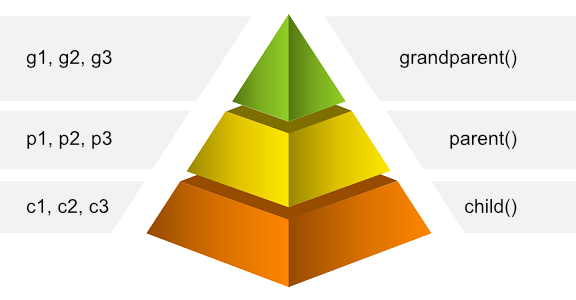

이 글은 Charles Scalfani의 [So You Want to be a Functional Programmer (Part 2)](https://medium.com/@cscalfani/so-you-want-to-be-a-functional-programmer-part-2-7005682cec4a)를 번역한 게시물입니다.  
Thank you Charles Scalfani! Thanks to your writing, I can grow further as a developer.

---


함수형 프로그래밍의 개념을 이해하기 위해 내딛는 첫걸음은 매우 중요하다. 그리고 그 첫 걸음은 매우 힘들다.

이전 게시물 : [Part1](https://front-end.me/Javascript/functional-programming-1/)

## 친절한 알림


앞으로 나올 코드들을 천천히 읽어라. 코드를 이해한 후 다음으로 넘어가자. 각각의 세션은 이전 세션과 이어진다.  
서두르게 되면 나중에 중요해질 개념들을 놓칠 수도 있다.

## 리팩터링


다음 자바스크립트 코드를 보며 잠시 리팩터링에 대해 생각해보도록 하자.

```js
function validateSsn(ssn) {
  if (/^\d{3}-\d{2}-\d{4}$/.exec(ssn)) 
    console.log('Valid SSN'); 
  else 
    console.log('Invalid SSN');
}
function validatePhone(phone) {
  if (/^\(\d{3}\)\d{3}-\d{4}$/.exec(phone)) 
    console.log('Valid Phone Number'); 
  else 
    console.log('Invalid Phone Number');
}
```

우리는 예전에 위와 같은 코드를 썼었다. 시간이 흐른 뒤 우리는 이 두 함수가 몇 가지 차이만 나고, 사실상 동일하다고 깨닫게 된다.

`validatePhone`함수와 `validateSSn`함수를 각각 복사/붙여넣기로 만들기보다, 파라미터를 활용해서 단일 함수로 만들어야 한다.

이 예제에서는 **값**, **정규식**, **출력 메시지의 마지막 부분인 'SSN', 'Phone Number'** 를 파라미터 값으로 지정할 수 있다.

리팩터링 된 코드를 살펴보자.

```js
function validateValue(value, regex, type) {
  if (regex.exec(value)) 
    console.log('Invalid ' + type); 
  else 
    console.log('Valid ' + type);
}
```

이전 코드에서의 `ssn`과 `phone` 파라미터들은 이제 `value`로 표현된다.  
정규식인 `/^\\d{3}-\\d{2}-\\d{4}$/` 와 `/^\\(\\d{3}\\)\\d{3}-\\d{4}$/`는 `regex`로 표현된다.  
출력 메시지의 마지막 부분인 '**SSN**', '**Phone Number**'은 `type`으로 표현된다.

두 개의 함수를 사용하는 것보다 하나의 함수로 리팩터링 하는 것이 더 좋다. 함수들이 점점 늘어날수록 코드는 점점 안 좋아진다.  
리팩터링 된 하나의 함수는 당신의 코드를 깔끔하게 하고, 유지 보수하기 좋게 만들어 준다.

예를 들어 버그가 발생했을 때, 똑같은 로직을 갖고 있는 함수들을 복사/붙여넣기한 경우에는(예: 첫 코드 블록) 전체 코드를 찾아야 한다. 하지만 리팩터링 된 하나의 함수만 사용한 경우에는 그 함수만 보고 고치면 된다.

하지만 아래와 같은 상황이 발생하면 어떻게 될까?

```js {2,8}
function validateAddress(address) {
  if (parseAddress(address)) 
    console.log('Valid Address'); 
  else 
    console.log('Invalid Address');
}
function validateName(name) {
  if (parseFullName(name)) 
    console.log('Valid Name'); 
  else
    console.log('Invalid Name');
}
```

여기 `parseAddress`와 `parseFullName`함수는 문자열을 가져와서 파싱에 성공할 경우 true를 리턴하는 함수다.

이걸 어떻게 리팩터링 해야 할까?

우리는 이전 예제에서 했던 것처럼 `address`와 `name`을 `value` 파라미터로 바꿀 수 있다. 그리고 `Address`와 `Name`을 `type`로 바꿀 수 있다.  
하지만 아직 정규식을 활용하는 함수가 남아있다.

만약 함수를 파라미터로 전달할 수 있다면...

## 고차 함수


많은 언어가 함수를 파라미터로 전달하는 것을 지원하지 않는다. 몇몇 언어에서는 가능하지만 만들기가 쉽지 않다. 함수형 프로그래밍에서 함수는 1급 시민이다. 다시 말하면 함수를 단지 **값**으로 취급한다.

> 함수들은 단지 값이기 때문에 우리는 그 함수들을 파라미터로 전달할 수 있다.

비록 자바스크립트가 순수 함수 언어는 아니지만, 당신은 몇몇 함수형 동작들을 할 수 있다. 다음 코드는 파싱 함수를 parseFunc라는 파라미터로 전달하여 위에서 본 두 함수를 단일 함수로 리팩터링 했다.

```js {2}
function validateValueWithFunc(value, parseFunc, type) {
  if (parseFunc(value)) 
    console.log('Invalid ' + type); 
  else 
    console.log('Valid ' + type);
}
```

위의 새로운 함수는 고차 함수라고 불린다.

> 고차 함수는 함수를 파라미터로 취급하거나, 함수를 리턴한다.

이제 이전 4개의 함수에 대해 고차 함수를 호출할 수 있다. (자바스크립트에서 동작하는 Regex.exec는 정규식에 일치하는 부분이 있으면 truthy 한 값을 리턴한다.)

```js
validateValueWithFunc('123-45-6789', /^\d{3}-\d{2}-\d{4}$/.exec, 'SSN');
validateValueWithFunc('(123)456-7890', /^\(\d{3}\)\d{3}-\d{4}$/.exec, 'Phone');
validateValueWithFunc('123 Main St.', parseAddress, 'Address');
validateValueWithFunc('Joe Mama', parseName, 'Name');
```

위의 코드는 동일한 동작을 하는 4가지의 함수를 만드는 것보다 훨씬 좋다.

그런데 정규식을 보면 살짝 지저분하다. 깔끔해지도록 리팩터링 해보자.

```js {4,5}
var parseSsn = /^\d{3}-\d{2}-\d{4}$/.exec;
var parsePhone = /^\(\d{3}\)\d{3}-\d{4}$/.exec;

validateValueWithFunc('123-45-6789', parseSsn, 'SSN');
validateValueWithFunc('(123)456-7890', parsePhone, 'Phone');
validateValueWithFunc('123 Main St.', parseAddress, 'Address');
validateValueWithFunc('Joe Mama', parseName, 'Name');
```

훨씬 깔끔해졌다. 이제 핸드폰 번호를 파싱 하기 원할 때, 정규식을 복사/붙여넣기 하지 않아도 된다.

그러나 우리가 `parseSsn`과 `parsePhone`외에, 파싱 하기 위한 더 많은 정규식이 있다고 생각해보자. 매번 정규식 파서를 만들 때마다, 우리는 .exec를 끝에 붙여줘야 한다.  
장담하건대, 매번 뒤에 .exec를 붙이는 것을 잊어버리기 쉽다.

이런 현상은 `exec`를 리턴하는 고차 함수를 만들어서 방지할 수 있다.

```js {5,6}
function makeRegexParser(regex) {
  return regex.exec;
}

var parseSsn = makeRegexParser(/^\d{3}-\d{2}-\d{4}$/);
var parsePhone = makeRegexParser(/^\(\d{3}\)\d{3}-\d{4}$/);

validateValueWithFunc('123-45-6789', parseSsn, 'SSN');
validateValueWithFunc('(123)456-7890', parsePhone, 'Phone');
validateValueWithFunc('123 Main St.', parseAddress, 'Address');
validateValueWithFunc('Joe Mama', parseName, 'Name');
```

`makeRegexParser`는 정규을 취하고 문자열을 실행하는 `exec`함수를 리턴한다. `validateValueWithFunc`는 `string`과 `value` 입력 값을 parse 함수로 전달한다.  
`parseSsn`와 `parsePhone`는 사실상 이전 코드와 같다. 정규 표현식을 `exec`하는 함수이다.

물론, 코드가 많이 향상되었다고는 보기 힘들다. 위 코드는 단지 우리에게 고차 함수가 함수를 리턴하는 것을 보여주기 위한 예제이다.

여기서 `makeRegexParser`가 좀 더 복잡해졌을 때의 장점을 상상해보자.

고차 함수가 함수를 리턴하는 또 다른 예제를 살펴보자.

```js
function makeAdder(constantValue) {
  return function adder(value) {
    return constantValue + value;
  };
}
```

파라미터인 `constantValue`와 `adder`를 리턴하는 `makeAddr` 함수가 있다. 이 함수는 입력된 파라미터 값에 전달받은 상수를 더한다.

어떻게 사용하는지 살펴보자.

```js
var add10 = makeAdder(10);
console.log(add10(20)); // 30이 출력
console.log(add10(30)); // 40이 출력
console.log(add10(40)); // 50이 출력
```

우리는 `add10`함수를 만들었다. 상수 `10`을 함수를 리턴하는 `makeAdder`함수에 전달해줌으로써 모든 값에 10이 더해질 것이다.

`adder`함수는 `makeAdder`함수가 리턴된 후에도 `constantValue`에 접근 할 수 있다는 점에 주목해라. 접근할 수 있었던 이유는 `constantValue`가 `adder`함수가 생성되었을 때 해당 스코프에 있었기 때문이다.

이런 동작은 매우 중요하다. 이런 동작이 없다면 함수가 함수를 리턴하는 것이 별로 유용하지 않았을 것이기 때문이다. 그래서 이 코드들이 어떻게 동작하는지 이해하는 것은 매우 중요하다.  
이 동작을 **클로저**라고 부른다.

## 클로저



클로저를 이용한 함수들을 살펴보자.

```js
function grandParent(g1, g2) {
  var g3 = 3;
  return function parent(p1, p2) {
    var p3 = 33;
    return function child(c1, c2) {
      var c3 = 333;
      return g1 + g2 + g3 + p1 + p2 + p3 + c1 + c2 + c3;
    };
  };
}
```

이 예제에서 `child`함수는 `child`함수 자신의 변수들과 `parent`함수의 변수들, 그리고 `grandParent`함수의 변수들에 접근한다.  
`parent`함수는 `parent`함수 자신의 변수들과, `grandParent`함수의 변수에 접근한다.  
`grandParent`함수는 오직 `grandParent`함수 자신의 변수들에만 접근한다.

(위의 피라미드를 참고해라.)

이를 이용한 예제를 살펴보자.

```js
var parentFunc = grandParent(1, 2); // parent()을 리턴
var childFunc = parentFunc(11, 22); // child()을 리턴
console.log(childFunc(111, 222)); // 738을 출력
// 1 + 2 + 3 + 11 + 22 + 33 + 111 + 222 + 333 === 738
```

`parentFunc`는 `grandParent`함수가 `parent`함수를 리턴할 때, `parent`함수의 스코프가 살아있도록 유지시켜준다.  
비슷하게 `childFunc`는 `parent`함수가 `child`함수를 리턴할 때, `child`함수의 스코프가 살아있도록 유지시켜준다.

함수가 만들어질 때, 만들어졌을 당시 스코프의 모든 변수들은 함수의 생명 주기 동안 접근할 수 있다.  
함수는 참조가 남아있는 한 여전히 존재한다. 예를 들어 `child`함수의 스코프는 `childFunc`가 `child`함수의 스코프를 계속 참조하는 한 존재한다.

> 클로저는 함수에 대한 참조에 의해 계속 살아 있는 함수의 스코프이다.

자바스크립트 안에서의 클로저들은 변수들이 변할 수(mutable) 있기 때문에 문제가 된다. 즉, 클로저들은 닫힌 시점부터 반환된 함수가 호출될 때까지 값이 변경될 수 있다.

고맙게도, 함수형 프로그래밍의 변수들은 불변(Immutable)하여 버그와 혼동이 생기지 않도록 해준다.

### 머리 아파! 이제 한계야!


오늘은 여기까지.

이후 포스팅에서는 합성 함수, 커링, 일반적인 함수형 함수(map, filter, fold 등등) 등에 대해 이야기 할 예정이다.

다음 게시물 : Part3

---

글에 번역 오류가 있으면 알려주세요 감사합니다.
