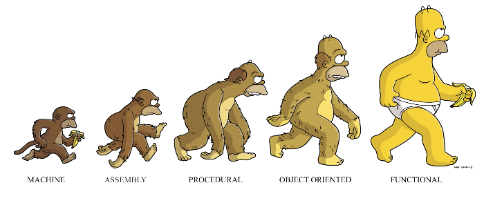

이 글은 Charles Scalfani의 [So You Want to be a Functional Programmer (Part 3)](https://medium.com/@cscalfani/so-you-want-to-be-a-functional-programmer-part-3-1b0fd14eb1a7)를 번역한 게시물입니다.   
Thank you Charles Scalfani! Thanks to your writing, I can grow further as a developer.

---



함수형 프로그래밍의 개념을 이해하기 위해 내딛는 첫걸음은 매우 중요하다. 매우 힘든 첫걸음이지만 올바른 관점으로 접근한다면 힘들어할 필요가 없다.

이전 게시물 : [Part 1](https://front-end.me/javascript/functional-programming-1/), [Part 2](https://front-end.me/javascript/functional-programming-2/)

## 합성 함수


프로그래머로서 우리는 게으르다(좋은 뜻). 우리는 빌드, 테스트, 배포 코드를 계속해서 작성하는 것을 원하지 않는다.  
우리는 항상 일을 한 번만 하는 방법과 그것을 어떻게 재 사용하여 다른 일을 할 수 있는지 알아내려고 노력한다.

코드 재사용은 언제나 옳지만, 그것을 실제로 실천하긴 어렵다.   
코드를 굉장히 상세하게 만들면, 그것을 재사용할 수 없다. 그렇다고 너무 일반적으로 만들면 애당초 사용하기 어려울 수 있다. 코드를 작고 재사용이 가능한 조각으로 만들면 그 코드는 더 복잡한 기능의 조각이 될 수 있다.    
그렇기 때문에 이 둘 사이의 균형을 잡는 것이 중요하다.   
함수형 프로그래밍에서, 함수들은 빌딩 블록이다. 우리는 매우 구체적인 작업을 하기 위해 함수들을 작성하고, 레고 블록처럼 조립한다.

이것이 **합성함수**이다.

그래서 합성함수는 어떻게 동작할까? 다음 두개의 자바스크립트 함수를 살펴보자.


```js 
var add10 = function(value) {
  return value + 10;
};

var mult5 = function(value) {
  return value * 5;
};
```


꽤 복잡하다. **화살표 함수 표현식**을 사용해보자.

```js 
var add10 = value => value + 10;
var mult5 = value => value * 5;
```

한결 나아졌다. 이제 `value`에 10을 더한 값에 5를 곱하는 함수가 필요하다고 생각해보자. 다음과 같이 작성할 수 있을 것이다.

```js 
var mult5AfterAdd10 = value => 5 * (value + 10)
```

매우 간단한 예제이긴 하지만, 함수를 이렇게 작성하는 것은 좋지 않다. 그 이유는  
첫째, 괄호를 잊어버리는 실수를 할 수 있다.  
둘째, 우리는 이미 `add10`함수와 `mult5`함수를 갖고 있다. 즉, 이미 있는 함수들을 다시 작성하고 있는 것이다.

그러니 `add10`함수와 `mult5`함수를 이용해서 새로운 함수를 만들어보자.

```
var mult5AfterAdd10 = value => mult5(add10(value));
```

우리는 단지 **기존에 있던 함수**를 이용해서 `mult5AfterAdd10` 이라는 함수를 만들었다. 당연히 함수를 새로 만드는 것보다 이 방법이 더 좋다.     
수학에서, `f ∘ g`는 합성 함수이다. 그리고 **"g composed with f"** 또는 **"f after g"** 라고 읽는다.    
그래서 `(f ∘ g)(x)` 는 `x`값과 함께 함수 `g`를 호출한 후, 함수 `f`를 호출한 것과 같다. 간단히 표현하자면 `f(g(x))`와 동일하다.

예제에서 우리는 `mult5 ∘ add10`("mult5 after add10")를 사용했다, 그러므로 이 함수의 이름은 **mult5AfterAdd10** 이라고 볼 수 있다.    
매개변수(argument) `value`가 `add10`함수에 전달되고 함수가 호출된 후에, `mult5`함수를 호출했다.    
간단히 표현하자면 `mult5(add10(value))`와 동일하다.

네이티브 자바스크립트는 합성함수가 없기 때문에 Elm을 예로 들어보겠다.

```elm
add10 value =
    value + 10
mult5 value =
    value * 5
mult5AfterAdd10 value =
    (mult5 << add10) value
```


Elm에서는 << 라는 연산자로 함수를 합성한다. 이 연산자는 데이터가 어떻게 흘러가는지 시각적으로 알려준다.    
첫 번째로 `value`가 `add10`으로 전달된다. 그 결과는 `mult5`로 전달된다.

`mult5AfterAdd10`에 있는 괄호,`(mult5 << add10)`를 주시하자. 이것은 `value`를 적용하기전에 확정적으로 함수끼리 합성을 시키기 위해 괄호가 존재한다.

다음과 같은 방법으로 당신이 원하는 만큼 함수들을 합성할 수 있다.

```elm
f x =
   (g << h << s << r << t) x
```

`x`는 함수 `t`에 전달되고, 그 결과 값이 `r`로 전달된 후, 그 결과 값이 `s`로 전달된다. 이런 식으로 마지막 `g`까지 전달된다.  
만약 자바스크립트에서 이와 같은 기능을 구현한 적이 있었다면, 그건 `g(h(s(r(t(x)))))`로 작성해야 할 것이다. 괄호가 끔찍하다.

### Point-Free 표기법


파라미터를 정의할 필요 없이 함수를 작성하는 **Point-Free 표기법**이라는 코딩 방식이 있다.  
처음 보는 사람들은 이 방식이 이상하게 보일 것이지만, 계속 사용하다 보면 이 방식의 간결함에 감탄할 것이다.

당신은 `mult5AfterAdd10`함수에서 `value`가 파라미터 리스트에서 한 번, 사용될 때 한 번, 총 두 번 정의되었다는 것을 알아차렸을 것이다.


```elm
-- 이 함수는 파라미터가 1개다. 

mult5AfterAdd10 value =
    (mult5 << add10) value
```


그러나 이 파라미터는 `add10`함수에서 동일한 파라미터를 사용할 것이기 때문에 필요하지 않다. 같은 동작을 하는 Point-Free 방식으로 바꾸면 아래와 같다.

```elm
-- 이 함수 또한 파라미터가 1개다.

mult5AfterAdd10 =
    (mult5 << add10)
```


Point-Free 방식을 이용하면 더 많은 이점이 있다.

첫 번째, 우리는 불필요한 파라미터를 정의하지 않아도 된다. 그로 인해 정의할 파라미터 이름을 생각하느라 머리를 싸매지 않아도 된다.  
두 번째, 덜 복잡해지기 때문에 좀 더 읽기 쉬워진다. 위의 예시는 단순하다. 하지만 함수 하나에 무수한 파라미터들이 있다고 상상해보자.

## 파라다이스에서의 문제


지금까지 어떻게 합성 함수가 동작하는지와 간결성, 명확성, 그리고 유연성을 위해 Point-Free 표기법으로 어떻게 함수를 정의해야 하는지를 살펴보았다.   
이제 조금 다른 시나리오에서 이 아이디어들을 사용해보고, 그것들이 어떻게 진행되는지 살펴보자. `add10`함수를 `add`함수로 변경한다고 상상해보자.


```elm
add x y =
    x + y
mult5 value =
    value * 5
```


어떻게 위의 두 함수를 이용해서 `mult5AfterAdd10` 함수를 만들까?  
읽던걸 멈추고 잠시 생각해보자. 생각이 끝났다면 작성해보자. 작성이 끝났다면 비교해보자. 당신은 아래와 같이 작성했을 수도 있다.

```elm
-- 이 함수는 잘못됐어!!!

mult5AfterAdd10 =
    (mult5 << add) 10 
```

하지만 이 함수는 동작하지 않는다. `add`함수의 파라미터가 2개이기 때문이다.
만약 Elm으로 이 개념을 이해하기 어렵다면 Javascript로 작성해보자.

```js
var mult5AfterAdd10 = mult5(add(10)); // 이 함수는 동작하지 않는다.
```

이 코드는 왜 잘못됐을까?

`add`함수는 2개의 파라미터가 필요한데 1개만 입력받았다. 그리고 그 **부정확한 결과**가 `mult5`함수로 전달되었고, 이는 결국 잘못된 결과를 산출할 것이다.

사실 Elm이었으면, 컴파일러 단계에서 에러가 발생할 것이다(Elm의 위대한 장점 중 하나). 다시 작성해보자.

```js
var mult5AfterAdd10 = y => mult5(add(10, y)); // not point-free
```

이것은 Point-Free 방식이 아니지만, 이 방식으로도 동작은 한다. 하지만 더 이상 함수를 결합하지 못한다.     
이 함수가 점점 더 복잡해질수록 문제가 생긴다. 만약 `mult5AfterAdd10`함수와 다른 함수를 결합하고 싶을 때가 되면 정말 곤란해질 것이다.     
결국, 합성 함수의 유용성은 한계가 있으므로 이 두 개의 함수를 결합할 수 없게 되었다. 너무 아쉽다.

이 문제를 어떻게 해결할 수 있을까?

만약 `add`함수에 단 하나의 파라미터를 미리 전달하고, 두 번째 파라미터는 `mult5AfterAdd10`함수를 호출할 때 전달하는 방법이 있다면 훌륭할 것 같다.

찾아보니 방법이 있다. 바로 **커링(currying)** 이라는 방법이다.

### 머리 아파! 이제 한계야!!


오늘은 여기까지.

이후 게시물에서는 커링, 함수형 함수(map, filter, fold 등등), 참조 투명성 등에 대해 이야기할 예정이다.

다음 게시물: [Part 4](https://front-end.me/javascript/functional-programming-4/)

---

글에 번역 오류가 있으면 알려주세요 감사합니다.
