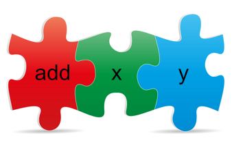

이 글은 Charles Scalfani의[So You Want to be a Functional Programmer (Part 4)](https://medium.com/@cscalfani/so-you-want-to-be-a-functional-programmer-part-4-18fbe3ea9e49#.iddazh5wz)를 번역한 게시물입니다.   
Thank you Charles Scalfani! Thanks to your writing, I can grow further as a developer.

---


함수형 프로그래밍의 개념을 이해하기 위해 내딛는 첫걸음은 매우 중요하다. 매우 힘든 첫걸음이지만 올바른 관점으로 접근한다면 힘들어할 필요가 없다.  
  
이전 게시물 : [Part 1](https://front-end.me/Javascript/functional-programming-1/), [Part 2](https://front-end.me/Javascript/functional-programming-2/), [Part 3](https://front-end.me/Javascript/functional-programming-3/)

### 커링



  
  
[Part 3](https://front-end.me/javascript/functional-programming-3/#%ED%8C%8C%EB%9D%BC%EB%8B%A4%EC%9D%B4%EC%8A%A4%EC%97%90%EC%84%9C%EC%9D%98-%EB%AC%B8%EC%A0%9C)의 마지막 부분에서 `mult5` 함수는 1개의 파라미터를 받고, `add` 함수는 2개의 파라미터를 받았기 때문에 `mult5` 함수와 `add5` 함수를 합성할 때 문제가 발생했었다.  
  
우리는 모든 함수가 **1개의 파라미터만 받도록 제한**함으로써 이 문제를 해결할 수 있다.  
  
나를 믿어라. 이건 그렇게 나쁜 방법이 아니다  
  
우리는 2개의 파라미터를 사용하지만 한 번에 1개만 사용하는 `add` 함수를 작성한다. **커링** 함수는 이것을 가능하게 해 준다.

> 커링 함수는 한 번에 1개의 파라미터만 받는 함수이다.  

커링 함수는 우리가 `mult5` 함수와 합성하기 전에, 첫 번째 파라미터를 `add` 함수에게 준다. 그 후에 `mult5AfterAdd10` 함수가 호출될 때, `add` 함수는 두 번째 파라미터를 받게 된다.  
  
이제 자바스크립트에서 `add` 함수에 커링을 적용한 것을 살펴보자.

```js
var add = x => y => x + y
```

  
이 `add` 함수는 지금은 하나의 파라미터만 받고, 나중에 또 다른 하나의 파라미터를 받는 함수이다.  
  
자세히 말하면, `add` 함수는 1개의 파라미터 `x`를 받고, 1개의 파라미터 `y`를 받는 함수를 리턴하는데, 이는 결국 **x와 y를 합하는 결과**를 리턴하게 된다.  
  
이제 우리는 이 `add` 함수를 이용하여 개선된 `mult5AfterAdd10` 함수를 만들 수 있다.  
  

```js
var compose = (f, g) => x => f(g(x));
var mult5AfterAdd10 = compose(mult5, add(10));
```

  
이 합성함수는 2개의 파라미터 `f`와 `g`를 받는다. 그리고 `x`라는 1개의 파라미터를 받는 함수를 리턴한다. 이 함수가 호출될 때 `g`함수에 `x`를 적용한 후에 그 결과를 `f`함수에 적용한다.  
  
그래서 우리가 한건 뭘까? 단순한 구식 `add` 함수를 커링 방식의 버전으로 바꿨다. 첫 번째 파라미터인 10을 상위 함수에 전달할 수 있고, 마지막 파라미터는 `mult5AfterAdd10`이 호출될 때 전달될 것이다. 때문에 `add` 함수는 좀 더 유연해졌다.  
  
이쯤 되면, Elm에서 커링을 이용한 `add` 함수를 어떻게 만들지 궁금할 것이다.  
  
궁금할 필요가 없다. Elm를 포함한 다른 함수형 언어에서는 모든 함수가 자동으로 커링이 된다.  
  
그래서 add 함수를 다음과 같이 쓸 수 있다.  
  
```elm
add x y =
    x + y
```

  
아래 코드가 바로 [Part 3](https://front-end.me/javascript/functional-programming-3/#%ED%8C%8C%EB%9D%BC%EB%8B%A4%EC%9D%B4%EC%8A%A4%EC%97%90%EC%84%9C%EC%9D%98-%EB%AC%B8%EC%A0%9C)에서 작성되었어야 할 `mult5AfterAdd10` 함수다.

```elm
mult5AfterAdd10 =
    (mult5 << add 10)
```

  
Elm은 자바스크립트 같은 명령형 언어보다 뛰어나다. 왜냐하면 Elm은 커링과 합성 같은 함수형 프로그래밍 최적화에 되어있기 때문이다.

## 커링과 리팩터링


  
**많은** 파라미터를 받는 일반 버전의 함수를 만든 다음, **적은** 파라미터를 받는 특정 버전의 함수를 만들기 위한 리팩터링을 할 때 커링은 다시 한번 빛난다.  
  
문자열에 단일 괄호 세트와, 이중 괄호 세트를 추가하는 함수를 확인해보자.

```elm
bracket str =
    "{" ++ str ++ "}"
doubleBracket str =
    "{{" ++ str ++ "}}"
```

사용 방법은 다음과 같다.

```elm
bracketedJoe =
    bracket "Joe"
doubleBracketedJoe =
    doubleBracket "Joe"
```

  
우리는 이제 bracket과 doubleBracket을 생성할 수 있다.  

```elm
generalBracket prefix str suffix =
    prefix ++ str ++ suffix
```

  
하지만 이제 `generalBracker`함수를 사용할 때마다 bracket을 넘겨줘야 한다.  

```elm
bracketedJoe =
    generalBracket "{" "Joe" "}"
doubleBracketedJoe =
    generalBracket "{{" "Joe" "}}"
```

  
사실 우리가 정말로 원하는 것은 일거양득(the best of both worlds)이다.  
  
만약 우리가 `generalBracket`함수의 파라미터의 순서를 바꾼다면, 커링 함수라는 사실을 활용하여 **bracket**과 **doubleBracket**을 생성할 수 있다.

```elm
generalBracket prefix suffix str =
    prefix ++ str ++ suffix
bracket =
    generalBracket "{" "}"
doubleBracket =
    generalBracket "{{" "}}"
```

  
먼저 static으로 고정할 부분(`prefix`와 `suffix`)을 첫 번째 파라미터에 넣고, 변경될 가능성이 높은 파라미터(`str`)를 가장 마지막에 배치하면 쉽게 `generalBracket`의 특정 버전을 생성할 수 있다.

> 파라미터의 순서는 완전한 커링 활용을 위해서 중요하다.  

  
또한 `bracket`과 `doubleBracket`은 **Point-Free 표기법** 즉, `str` 파라미터가 함축되었다는 것에 주목하자. `bracket`과 `doubleBracket` 모두 마지막 파라미터를 기다리고 있는 함수이다.  
  
이제 우리는 이전과 동일하게 사용할 수 있다.  
  

```elm
bracketedJoe =
    bracket "Joe"
doubleBracketedJoe =
    doubleBracket "Joe"
```

  
  

## 일반적인 함수형 함수  


 
함수형 언어들에서 사용하는 일반적인 함수 3가지를 알아보자.  
  
그전에, 아래의 자바스크립트 코드를 살펴보자.

```js
for (var i = 0; i < something.length; ++i) {
    // do stuff
}
```

이 코드는 큰 문제가 있다. 버그는 아니다.    
그 문제는 바로 boilerplate 코드다. 즉, 준비 코드를 계속 반복해서 작성해야 한다는 것이다.  
  
만약 당신의 코드가 Java, C#, 자바스크립트, PHP, Python 같은 명령형 언어에서 작성한 코드라면, 당신은 함수형 언어보다 더 많은 boilerplate 코드를 작성하고 있는 자기 자신을 발견할 것이다.  
  
그러니 boilerplate를 없애보자. boilerplate를 하나 또는 두 함수 안에 넣고 다시는 for-loop를 작성하지 않도록 해보자. 음... 사실 명령형 언어가 아닌 함수형 언어를 사용하기 전까지 불가능하다고 보면 된다.  
  
다음 `things`라는 배열로 예를 들어보자.

```js
var things = [1, 2, 3, 4];
for (var i = 0; i < things.length; ++i) {
    things[i] = things[i] * 10; // MUTATION ALERT !!!!
}
console.log(things); // [10, 20, 30, 40]
```
  
안돼! 불변(immutable)하지 않잖아!!  
  
이번엔 `things`가 불변(immutable)하도록 다시 시도해 보자.   

```js {2,4}
var things = [1, 2, 3, 4];
var newThings = [];
for (var i = 0; i < things.length; ++i) {
    newThings[i] = things[i] * 10;
}
console.log(newThings); // [10, 20, 30, 40]
```

  
 `things`를 불변(immutable)하게 만들었지만, `newThings`는 여전히 가변(mutable)적이다.  
일단 이 사실을 무시하고 넘어가자. 위의 코드는 명령형 프로그래밍 언어인 자바스크립트로 작성한 것이니까. 우리가 함수형 언어(예: Elm)를 사용한다면 불변할 것이다.  
  
여기서 요점은 이러한 함수들이 어떻게 동작하는지 이해하고, 우리 코드의 소음(noise)을 줄일 수 있도록 돕는 것이다.  
  
이 코드를 함수형으로 바꿔보자. 우선 공통 함수 `map`을 호출할 것이다.    
이 함수는 이전 배열의 각 요소를 새 배열의 새 값에 매핑시켜주는 성질이 있다.  
  

```js
var map = (f, array) => {
    var newArray = [];
    for (var i = 0; i < array.length; ++i) {
        newArray[i] = f(array[i]);
    }
    return newArray;
};
```

  
함수 `f`가 전달되어 `map`함수가 `array`에 있는 각 요소에 원하는 작업을 할 수 있다는 것에 주목하자.  
  
이제 `map` 함수를 이용하기 위해 이전 코드를 다시 작성해보자.

```js
var things = [1, 2, 3, 4];
var newThings = map(v => v * 10, things);
```

  
for-loop가 없다!. 훨씬 읽기 쉬워졌고, 추론하기도 쉽다.  
  
기술적으로 map 함수 안에 for-loop가 있다. 그러나 적어도 더 이상 boilerplate 코드를 작성할 필요가 없어졌다.  
  
이제 또 다른 공통 함수인 `filter`를 작성해보자.  

```js
var filter = (pred, array) => {
    var newArray = [];
for (var i = 0; i < array.length; ++i) {
        if (pred(array[i]))
            newArray[newArray.length] = array[i];
    }
    return newArray;
};
```

  
`pred`가 어떤식으로 배열의 요소를 유지하고 싶으면 **True**, 요소를 버리고 싶으면 **False**를 리턴하는지 살펴보자.  
  
아래의 `filter` 함수가 홀수를 필터링하는 동작을 살펴보자.

```js
var isOdd = x => x % 2 !== 0;
var numbers = [1, 2, 3, 4, 5];
var oddNumbers = filter(isOdd, numbers);
console.log(oddNumbers); // [1, 3, 5]
```

  
새로운 `filter`함수를 사용하는 것은 직접 for-loop 반복문을 작성하는 것보다 매우 간단하다.  
  
마지막 공통 함수형 함수는 `reduce`이다. `reduce`는 리스트를 갖고 와서 하나의 값으로 줄이기 위해 사용되지만, 실제로는 훨씬 더 많은 것을 할 수 있다.  
  
아래 함수는 함수형 언어에서 **fold라고** 불린다.

```js
var reduce = (f, start, array) => {
    var acc = start;
    for (var i = 0; i < array.length; ++i)
        acc = f(array[i], acc); // f() 함수는 파라미터 2개를 받는다.
    return acc;
};
```

  
`reduce`함수는 `f`라는 감축 함수와 초기 값, 그리고 배열을 사용한다.  
  
감축 함수인 `f`는 2개의 파라미터, `array`의 최근 요소, 그리고 누산기인 `acc`를 받는다. `f`함수는 이 파라미터들을 사용하여 각 반복마다 새로운 누산기를 생성한다.  
반복이 끝나면, 최종 누산기의 값이 리턴된다.  
  
아래는 **fold**가 어떻게 동작하는지를 이해하기 위한 예제이다.

```js
var add = (x, y) => x + y;
var values = [1, 2, 3, 4, 5];
var sumOfValues = reduce(add, 0, values);
console.log(sumOfValues); // 15
```

  
`add`함수는 2개의 파라미터를 받아서 합한다.  
`reduce`함수는 **초기값**이 0부터 시작하고, 합치기 위해 배열 `values`에 이 값을 전달한다. `reduce`함수 안에서, 값이 반복됨에 따라 합이 누적된다. 마지막 총 누적된 결과값인 `sumOfValues`가 리턴된다.  
  
`map`, `filter`, 그리고 `reduce`함수는 boilerplate인 for-loop 반복문을 작성할 필요 없이 배열을 조작할 수 있게 해 준다.  
  
함수형 언어에서 `map`,`filter`, `reduce`는 훨씬 유용하다. 생성에서의 loop 조차 없고, 재귀로만 이루어져 있기 때문이다.    
반복(loop) 함수들은 프로그래밍에 그렇게 많은 도움을 주진 못한다. 하지만 필수적이다.

## 머리 아파! 이제 한계야!


오늘은 여기까지.  
  
이후 게시물에서는 참조 투명성, 실행 순서, 타입 등에 대해 이야기하려고 한다.  
  
다음 게시물 : [Part 5](https://front-end.me/Javascript/functional-programming-5/)

---

글에 번역 오류가 있으면 알려주세요 감사합니다.
