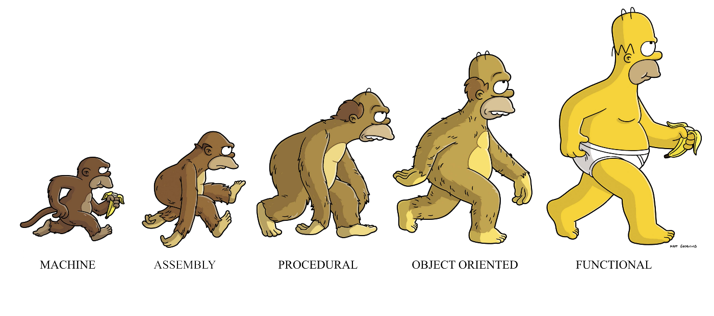

이 글은 Charles Scalfani의 [So You Want to be a Functional Programmer (Part 6)](https://medium.com/@cscalfani/so-you-want-to-be-a-functional-programmer-part-6-db502830403)를 번역한 게시물입니다.   
Thank you Charles Scalfani! Thanks to your writing, I can grow further as a developer.

---



함수형 프로그래밍 컨셉들을 이해하는 첫 단계가 가장 중요하고 때로는 가장 어려운 단계다.  
하지만 올바른 관점으로 접근한다면 그렇게 어렵지 않다.  
  
이전 게시물 : [Part 1](https://front-end.me/javascript/functional-programming-1/), [Part 2](https://front-end.me/javascript/functional-programming-2/), [Part 3](https://front-end.me/javascript/functional-programming-3/), [Part 4](https://front-end.me/javascript/functional-programming-4/), [Part 5](https://front-end.me/javascript/functional-programming-5/)

## 이제 어쩌지?


  
이 훌륭한 것들을 모두 배웠으니, 당신은 이렇게 생각할 것 이다. "이제 어쩌지? 이제까지 배운 것을 내 프로그래밍에 어떻게 적용시키지?"      
사정에 따라 다르다. 만약 당신이 Elm또는 Haskell처럼 순수 함수형 언어를 할줄 안다면, 이 개념들을 잘 활용할 수 있을 것이고 이 언어들이 잘 활용할 수 있도록 도와줄 것이다.     
만약 대부분의 사람들 처럼, Javascript 같은 명령형 언어를 사용한다면, 그동안 배웠던 것들을 많이 활용 할 수는 있지만, 훨씬 더 많은 연습이 필요할 것이다.

### 함수형 자바 스크립트  

자바스크립트는 함수형 프로그래밍을 할 수 있도록 해주는 많은 특징들을 갖고있다. 순수하진 않지만 약간의 불변성을 갖도록 해줄 수 있고, 라이브러리를 이용한다면 좀 더 높은 불변성을 갖도록 해줄 수 있다.   
이상적이지는 않지만, 만약 사용해야 한다면 함수형 프로그래밍의 이점을 얻지 않을 이유가 없다.

### 불변성
첫번째 고려해봐야 할 것은 불변성이다. ES2015(ES6)에서 나타난 새로운 키워드인 `const`가 있다. 이것은 일단 변수를 할당하면, 재할당이 불가능 하다.

```js
const a = 1;
a = 2; // this will throw a TypeError in Chrome, Firefox or Node
       // but not in Safari (circa 10/2016)
```

정의된 a는 상수이다. 그리고 한번 할당된 후에는 재할당이 불가능 하다. 이 이유로 `a = 2`는 에러가 발생한다.     
문제는 자바스크립트의 const는 한계가 있다는 것이다. 아래 예제를 살펴보자.

```js
const a = {
    x: 1,
    y: 2
};
a.x = 2; // NO EXCEPTION!
a = {}; // this will throw a TypeError
```

  
`a.x = 2`는 왜 에러가 발생하지 않았을까? 그 이유는 단지 변수 a만 `const`키워드로 불변성이 되었을 뿐이기 때문이다.. `a.*`은 불변하지 않다.   

이를 통해 `const`도 한계가 있다는 것을 알 수 있다.       
그럼 위의 코드를 완전한 불변성을 만들 수는 있을까?     
불행하게도, 우리는 Immutable.js 라이브러리를 사용하는 방법 밖에 없다. 이 라이브러리는 자바스크립트에게 좀더 나은 불변성을 갖게 해주지만, 코드를 자바처럼 보이게 만든다.

### 커링과 합성 함수  

이전 시리즈에서 커링함수를 어떻게 작성해야 하는지 배웠다.     
아래의 좀더 복잡한 예시를 살펴보자.

```js
const f = a => b => c => d => a + b + c + d
```
  
커링 부분을 직접 작성했다는 것에 주목하자.     
`f`함수를 호출할때 우리는 다음과 같이 작성해야 한다.

```js
console.log(f(1)(2)(3)(4)); // prints 10
```

**Lisp**프로그래머가 위의 많은 괄호를 봤다면 울었을 것이다.  
  
커링 함수를 작성하기 위한 많은 라이브러리가 있지만, 내가 가장 좋아하는 라이브러리는 [Ramda](https://ramdajs.com/)이다  
  
**Ramda**를 사용하면 아래와 같이 변경할 수 있다.  
  
```js
const f = R.curry((a, b, c, d) => a + b + c + d);
console.log(f(1, 2, 3, 4)); // prints 10
console.log(f(1, 2)(3, 4)); // also prints 10
console.log(f(1)(2)(3, 4)); // also prints 10
```

함수 정의는 그리 좋지 않지만, 모든 괄호를 넣을 필요는 없어졌다. 우리가 `f`함수를 호출할 때마다 원하는 만큼의 파라미터수를 정할 수 있다는 것에 주목하자.       
`Ramda`를 사용해서 [Part 3](https://front-end.me/javascript/functional-programming-3/)와 [Part 4](https://front-end.me/javascript/functional-programming-4/)에서 작성했던 `mult5AfterAdd10`을 개선해보자  
  
```js
const add = R.curry((x, y) => x + y);
const mult5 = value => value * 5;
const mult5AfterAdd10 = R.compose(mult5, add(10));
```
  
`Ramda`는 `R.add`, `R.multiply` 함수도 있다. 위의 코드를 다시한번 개선 해보자.  
  
```js
const mult5AfterAdd10 = R.compose(R.multiply(5), R.add(10));
```

## Map, Filter 그리고 Reduce
**Ramda** 라이브러리만의 `map`, `filter`, 그리고 `reduce`가 있다. 비록 이 함수들이 바닐라 자바스크립트의 `Array.prototype`에도 있지만, **Ramda** 라이브러리는 **커링**이 적용된다.  
  
```js
const isOdd = R.flip(R.modulo)(2);
const onlyOdd = R.filter(isOdd);
const isEven = R.complement(isOdd);
const onlyEven = R.filter(isEven);
const numbers = [1, 2, 3, 4, 5, 6, 7, 8];
console.log(onlyEven(numbers)); // prints [2, 4, 6, 8]
console.log(onlyOdd(numbers)); // prints [1, 3, 5, 7]
```

`R.modulo`는 2개의 파라미터를 받는다. 첫번째 파라미터는 **나눠지는 수**이고, 두번째 파라미터는 **나누는 수**이다.     
`isOdd` 함수는 2로 나눈 나머지 값이다. 나머지가 0이면 **falsey**(홀수가 아님), 나머지가 1이면 **truthy**(홀수)이다.    
우리는 2를 나누는 수로 지정하기 위해 `modulo`의 첫번 째와 두번 째 파라미터를 바꾼다.    
`isEven` 함수는 단지 `isOdd` 함수의 보수(complement)일 뿐이다.    
`onlyOdd` 함수는 `isOdd`의 조건자(boolean 값을 반환)가 있는 `filter` 함수이다.    
`onlyEven` 함수는 `isEven`을 조건자로 사용하는 `filter`이다.   
`numbers`를 `onlyEven`, `onlyOdd`에 넘겨줄 때, `isEven` 그리고 `isOdd`는 그들의 마지막 파라미터를 받고 우리가 기대한 숫자배열을 리턴한다.

## 자바스크립트의 단점들


대부분의 프론트엔드 개발자들은 브라우저에서 자바스크립트만을 사용한다. 왜냐하면 Javascript가 오랫동안 유일한 선택이었기 때문이다. 하지만 개발자들은 이제 자바스크립트를 직접 쓰는 것에서 멀어지고 있다.   
대신에 개발자들은 다른 언어로 작성한 후에 컴파일을 하고, 더 정확하게 자바스크립트로 변환한다.    
**CoffeeScript**는 이런 언어들중에 가장 첫번째로 나온 언어이다. 최근에는 Angular 2에서 채택한 타입스크립트가 있다. Babel 또한 자바스크립트로 변환기(transpiler)로 고려할만 하다.  
  
시간이 지날수록 사람들은 점점 더 이런 방식으로 프로그래밍을 하고 있다.  
하지만 이 언어들은 자바스크립트로부터 시작된 언어들이고, 좀더 나아졌을 뿐이다. 순수 함수형 언어에서 자바스크립트로 변환하는 방법은 어떨까?

## Elm  


이번 시리즈에서 Elm이 함수형 프로그래밍을 이해하는데 도움을 줄 것이다.  
  
>근데 Elm이 뭐야? 어떻게 쓰는 건데?  
  
Elm은 순수 함수형 언어이다. TEA(이 아키텍쳐는 Redux 개발자들에게 영감을 주었다.)라고 불리는 Elm 아키텍쳐를 사용하여 웹 응용 프로그램을 만드는데 사용할 수 있다.    
Elm 프로그램은 런타임 에러가 **없다.**      
Elm은 창시자인 Evan Czapliki가 일하는 [NoRedInk](https://www.noredink.com/) 회사에서 프로덕션으로 사용된다.(그는 [Prezi](https://prezi.com/)에서 일하기도 했다.)     
더 자세한 정보는 NoredInk 출신의 Richard Feldman의 [6 Months of Elm in Production](https://www.youtube.com/watch?v=R2FtMbb-nLs) 강연을 보면 좋다.

## 그럼 나의 모든 자바스크립트 코드를 Elm으로 교체해야 하나요?  

그럴필요는 없고 점차적으로 변경해가면 된다. 더 공부를 하고싶다면 다음 블로그를 보자. [How to use Elm at Work](https://elm-lang.org/news/how-to-use-elm-at-work)

## Elm을 배워야 하는 이유

1. 순수 함수 언어로 프로그래밍을 하는 것은 제한적이기도 하고 자유롭기도 하다. 
그것은 당신이 할 수 있는 것을 제한하지만 동시에 버그나, 나쁜 디자인으로부터 자유롭게 해준다.    
모든 Elm은 **Functionally Reactive Model**인 Elm 아키텍쳐를 따르기 때문이다.     
2. 함수형 언어는 당신이 더 좋은 프로그래머가 될 수 있도록 해준다. 이 글에 있는 내용들은 빙산에 일각이다. 당신은 프로그램을 경량화하고 안정되게 동작시키기 위해선 좀더 공부할 필요가 있다.     
3. 자바스크립트라는 언어를 만드는데 10일밖에 걸리지 않았다. 하지만 20년간 다소 함수적이고, 다소 객체지향 적이며, 완전히 명령형 프로그래밍 언어가 되었다. Elm은 수십년동안 수학과 컴퓨터 과학 분야에서 활동해온 Haskell 커뮤니티에서 30년간 배운 것을 이용해 디자인 되었다.     
Elm 아키텍쳐(TEA)는 수십년간 디자인되고 정제되었다. 그리고 Evan의 논문인 Functional Reactive Programming의 결과물이다. 이 디자인의 공식화에 들어간 사고(thinking)의 수준의 진가는 [Controlling Time and Space](https://www.youtube.com/watch?v=Agu6jipKfYw)를 보면 알 수 있다.  
4. Elm은 개발자들의 더 나은 삶을 목표로 프론트엔드 개발자에 의해 디자인 되었다. [Let's Be Mainstream](https://www.youtube.com/watch?v=oYk8CKH7OhE)를 보면 Elm의 목표를 좀 더 이해할 수 있을 것이다.

## 미래에는?  


미래에 대해서 단정짓는 것은 불가능 하다. 하지만 약간의 추측은 할 수 있다. 아래는 내가 추측한 것들이다.


- 자바스크립트로 컴파일 되는 언어들이 주목 받을 것이다.  
- 40년이상 존재해온 함수형 프로그래밍의 개념들은 소프트웨어의 복잡성 문제를 해결하기 위해 재평가 될 것이다.  
- 하드웨어의 상태(예: 대량의 값싼 메모리와 빠른 프로세서)는 함수형 기술들을 가능하게 할 것이다.  
- CPU는 더 이상 빨라지지 않겠지만 코어 수는 계속 증가할 것이다.  
- 가변(mutable) 상태는 복잡한 시스템에서 가장 큰 문제중 하나로 인식될 것이다.

나는 지난 몇년 동안을 함수형 프로그래밍을 배우면서(물론 아직도 배우는 중이다.), 함수형 프로그래밍이 미래라고 믿고있기 때문에 이 글들을 작성했다.  
  
내 목표는 다른 사람들이 이런 것들을 더 쉽게 배우고, 더 나은 프로그래머가 될 수 있도록 도와서 그들이 미래에 더 경쟁력 있는 직업을 가질수 있도록 돕는 것이다.  
  
Elm이 미래에 거대한 언어가 될 것이라는 나의 예측이 틀렸다고 하더라도, 나는 함수형 프로그래밍과 Elm이 미래에 그 궤도에 오를 것이라고 확실하게 말할 수 있다.  
  
이 글들을 읽은 후에 함수형 프로그래밍의 개념에 대한 당신의 능력과 이해력에 대해 더욱 자신감을 갖기를 바란다.  
  
앞으로의 당신의 노력에 행운을 빈다.

---

글에 번역 오류가 있으면 알려주세요. 감사합니다.
