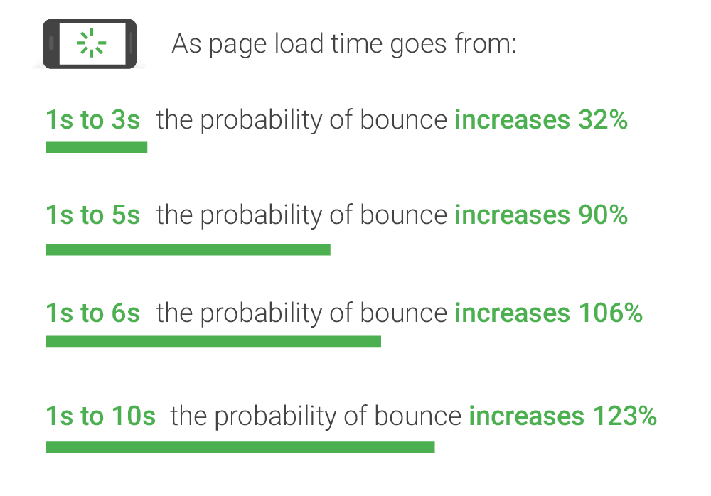

오늘은 웹 사이트 최적화에 대해 알아보겠습니다.   
웹 사이트 최적화는 웹 서비스에서 중요한 개념이자, 이후에 포스팅할 CSR(Client Side Rendering)과 SSR(Server Side Rendering), 그리고 SSG(Static Site Generation)를 설명하기 위해 필요한 개념입니다.

## 웹 사이트 최적화를 해야 하는 이유?
사용자가 페이지를 방문한 후, 아무런 요청을 하지 않고 떠나는 비율을 **이탈률**이라고 합니다.

위의 그래프를 보시면 알 수 있듯이, 페이지 로딩 속도에 대한 이탈률을 보면 로딩 시간이 3초가 걸리면 32%, 5초면 90%, 6초면 106%, 10초면 123% 라고 합니다.   
아무리 잘 만든 페이지라도, 사용자가 이용하지 않으면 말짱 도루묵 이겠죠? 이런 이탈률을 줄이기 위해 페이지 최적화가 필요합니다.

## 페이지 속도 측정에 가장 중요한 4가지 값

### TTFB(Time to First Byte)
사용자가 웹 사이트를 호출하면 웹 서버에서 수신한 첫 번째 바이트가 도착하는 시점입니다.  
즉, HTTP 요청에 걸리는 시간 + 서버의 요청 처리 시간 + 서버에서 클라이언트까지의 응답 시간이라고 보시면 됩니다.  
TTFB 속도는 서버의 프로세스와 연관되어 있습니다.

**최적화 방법**

1. 호스팅 업체 변경
2. CDN 사용
3. 서버 코드 경량화

 

### FCP(First Contentful Paint)

TTFB 이후에 DOM 콘텐츠(텍스트, 이미지, 캔버스 렌더링 등)가 표시되는 시점입니다.   
이 시점은 사용자가 이 웹 사이트가 실제로 동작한다고 인식하도록 해주기 때문에 중요합니다. (사용자 이탈률이 줄어듭니다.)   
Pagespeed Insights(페이지 속도를 측정해주는 구글 툴)에서는 TTFB 측정은 건너뛰고 FCP 측정을 첫 번째로 합니다. 이는 개발자를 위한 것이며, Pagespeed Insight는 FCP를 활용하여 OnPage 최적화(제목 태그, 콘텐츠, 내부 링크 및 URL 최적화)를 위한 제안을 해줍니다.   

**최적화 방법**
1. 데이터 압축
2. HTTP/2 사용
3. 리로드 할 필요 없는 콘텐츠를 캐싱
4. 코드 경량화와 코드 스플릿팅(splitting)
5. 라이브러리 정리

 

### FMP(First Meaningful Paint)
사용자에게 의미 있는 콘텐츠(Hero elements)가 그려지는 시점입니다. 주요 콘텐츠를 보여주는 css, js가 호출 됩니다.   
하지만 이벤트 리스너(화면 스크롤, 클릭 등)는 아직 추가되지 않았습니다.   
사용자는 이 시점에서 페이지가 완전히 로드가 되었다고 인식합니다. 그러므로 FMP의 최적화는 좀 더 중요합니다.

**최적화 방법**
1. 이미지 최적화
2. 사진이 많은 웹 페이지일 때는 LazyLoading (예: Twitter, Instagram 등 스크롤을 내리면 추가 페이지 로딩)

 

### TTI(Time To Interactive)
자바스크립트의 실행이 완료되어. 페이지가 상호작용 가능하게 될 때까지의 시점입니다.(이벤트 발생 등)
대부분의 페이지 속도 테스트는 이 값을 기초로 사용합니다.

**최적화 방법**

FCP와 FMP를 최적화

 

이제 실제 화면을 통해 시점들을 살펴보겠습니다. 밑의 FP(First Paint)는 첫 픽셀이 그려지는 시점입니다.

위의 화면들을 보시면 중요한 시점은 FCP와 FMP인 것을 알 수 있습니다. 우리가 웹 사이트를 방문한다고 생각해봅시다.  
페이지의 로딩이 끝날 때까지 흰 화면을 보여주기보다는, 화면을 부분적(FCP)으로 보여준 후 의미 있는 화면(FMP)을 보여주는 것이 좋겠죠?  
그러므로 사용자에게 페이지의 성능이 좋다는 느낌을 주기 위해서는 FCP와 FMP시간을 단축시켜야 합니다.

웹 사이트 성능 최적화 방법과 자세한 설명은 **TOAST UI**에서 포스팅한 [성능 최적화](https://ui.toast.com/fe-guide/ko_PERFORMANCE/)에서 확인해보시길 바랍니다.

## 오늘은 여기까지
이전 프로젝트를 진행할 때 한 개발자분께서 '화면 진입 시 로딩 중일 때 빈 화면에 약간이라도 보이는 것이 느려서 사용자가 심리적으로 느리다고 느껴질 것 같다. 
심지어 에러난 것처럼 보일 수도 있겠다' 고 말씀해주신 것이 떠올랐습니다.  
그 당시에는 '아 이런 상황에 대한 것도 개발 용어로 있지 않을까?'라고 생각했었는데, 이번 포스팅을 통해 알게 되어 기쁩니다.  
이제 용어를 배웠으니 나중에 그런 상황이 또 온다면 저는 이렇게 이야기해야겠습니다.
'화면 진입 시에 FCP 조차 느려서 사용자 이탈률이 증가할 것 같아요.'

글에 오류가 있으면 알려주세요 감사합니다.

## REFERENCES

Roland Guelle, 「 How to Measure Page Speed 」, https://en.ryte.com/magazine/measure-page-speed  

TOAST UI, 「 성능 최적화 」, https://ui.toast.com/fe-guide/ko_PERFORMANCE/
  
Philip Walton, 「 User-centric performance metrics 」, https://web.dev/user-centric-performance-metrics/

Bikash Rai, 「First Contentful Paint (FCP) and First Meaningful Paint (FMP) Explained」, https://www.acmethemes.com/blog/first-contentful-paint-and-first-meaningful-paint/
